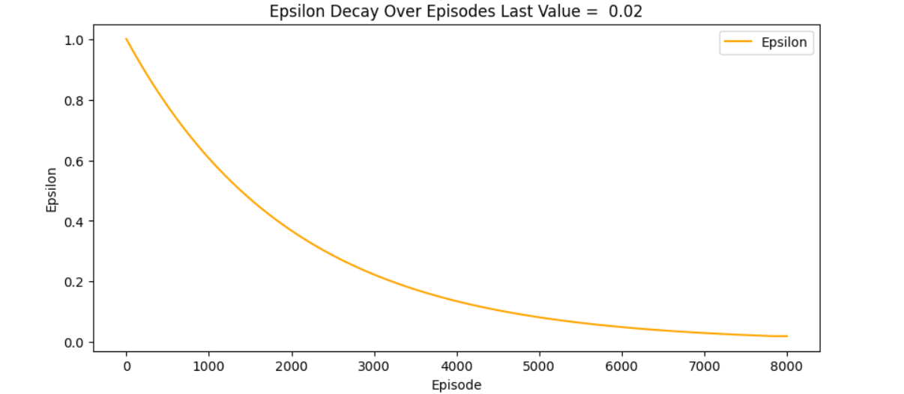
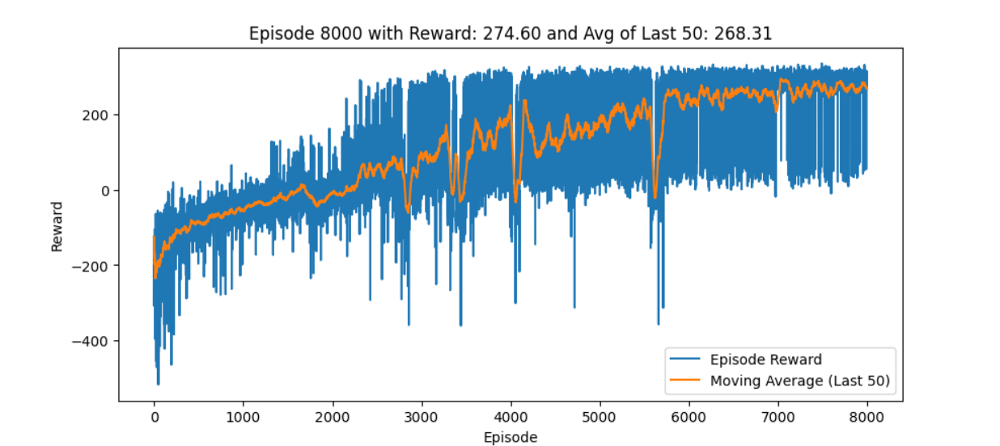

# Double DQN for LunarLander  
**Author: amanfoundongithub**

This project provides a clear and powerful PyTorch implementation of the Double Deep Q-Network (Double DQN) algorithm, trained and evaluated on the classic LunarLander environment. Designed for both learners and researchers, the repository demonstrates effective deep reinforcement learning in a dynamic, physics-based control task.

## About the LunarLander Environment

The **LunarLander** environment (from OpenAI Gym) simulates the challenge of landing a spacecraft precisely on a landing pad. The agent must control the lander's engines to safely touch down while avoiding crashes or drifting off screen. Rewards are given for successful landings and fuel-efficient maneuvers, while penalties result from crashing or leaving the area. Achieving an average reward of 200+ is considered "solving" the environment—demonstrating robust autonomous control.

## Project Structure

```
lunarlander_videos/    # Recorded agent gameplay videos
results/               # Training logs and experiment results
agent.py               # Double DQN agent class and logic
buffer.py              # Experience Replay Buffer implementation
net.py                 # Q-network definition in PyTorch
requirements.txt       # List of dependencies
test.py                # Scripts for evaluation and inference
train.py               # Main training script
```

## What is Double DQN?

**Double DQN** builds on the standard Deep Q-Network by reducing overestimation of state-action values. It uses separate networks for action selection and action evaluation during training, leading to better stability, improved sample efficiency, and more reliable learning—especially crucial in challenging tasks like LunarLander.

## Results & Analysis

### Training Analysis

- **Epsilon Decay:**  
  Exploration is gradually reduced throughout training. Epsilon started at 1.0 and decayed to 0.02 over 8,000 episodes, as seen in the plot below. This ensured the agent explored widely at first before exploiting its learned policy for optimal landings.
  
  
  
  **Reward Progress:**  
  The reward graph shows the learning curve of the agent. Initially, rewards are highly variable and often negative as the agent explores randomly. Over time, both the raw episode rewards and the moving average consistently increase.  
  By episode 8,000:
  - **Last episode reward:** 274.60
  - **Average of last 50 episodes:** 268.31  
  This is well above the 200 threshold for considering LunarLander solved.

  

- **Inference Analysis**
    After training, the agent was evaluated using a purely greedy policy (no exploration).  
    - **Mean reward during inference:** **284.55**  
    This demonstrates the agent reliably lands the lunar module successfully, performing efficient fuel management and achieving high scores in the environment across episodes.

## Getting Started

1. **Install Dependencies**
   ```bash
   pip install -r requirements.txt
   ```

2. **Train the Agent**
   ```bash
   python train.py
   ```

3. **Test the Agent**
   ```bash
   python test.py
   ```

4. **Explore Results and Videos**
   - Training logs and performance curves in `results/`
   - Agent gameplay recordings in `lunarlander_videos/`

**Summary:**  
- The Double DQN agent effectively solved the LunarLander environment, with stable training and high-performance inference.
- This repository offers an excellent starting point for further experimentation and learning in deep reinforcement learning.  
**Contributions and feedback are welcome! Feel free to raise a PR if needed.**

